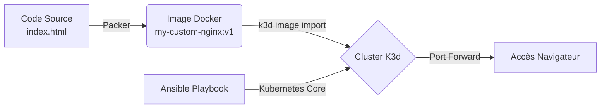

#  Atelier DevOps : De l'Image au Cluster


Ce projet a été réalisé dans le cadre de l'atelier **"Atelier from Image to Cluster"**.
L'objectif est d'industrialiser le cycle de vie d'une application Nginx : de la construction de l'image (Build) à son déploiement automatisé (Run) dans un environnement Kubernetes.

---

##  Architecture du projet

Le projet utilise l'approche **Infrastructure as Code** (IaC) pour garantir la reproductibilité.



1.  **Packer** : Construit une image Docker immuable basée sur Nginx, embarquant le site web statique.
2.  **K3d** : Simule un cluster Kubernetes complet (1 Master, 2 Workers) dans des conteneurs Docker.
3.  **Ansible** : Orchestre le déploiement des objets Kubernetes (Deployment, Service) de manière idempotente.

---

##  Prérequis

Ce projet est conçu pour être exécuté dans un **GitHub Codespace**.
Les outils nécessaires sont installés automatiquement via le Makefile ou les scripts fournis :
* `Packer`
* `Ansible` (avec collection `kubernetes.core`)
* `K3d`
* `Kubectl`

---

##  Démarrage Rapide

L'ensemble du processus est automatisé grâce à un **Makefile**.

### 1. Lancement de l'automatisation
Dans le terminal du Codespace, lancez simplement la commande suivante :

```bash
make all
```

> **Note :** Cette commande va installer les dépendances, builder l'image, l'importer dans le cluster et déployer l'application.

### 2. Vérification
Une fois le script terminé, vérifiez que les pods sont actifs :

```bash
kubectl get pods
```

### 3. Accès à l'application
Pour visualiser le site web, créez un tunnel vers le service :

```bash
kubectl port-forward svc/nginx-service 8082:80
```

Ouvrez ensuite votre navigateur (ou l'onglet "PORTS" de VS Code) à l'adresse : `http://localhost:8082`.

---

##  Structure des fichiers

| Fichier | Description |
| :--- | :--- |
| `Makefile` | **Point d'entrée**. Orchestre les commandes (setup, build, deploy). |
| `nginx.pkr.hcl` | Configuration **Packer**. Définit comment l'image Docker est construite. |
| `playbook.yml` | Configuration **Ansible**. Décrit l'état souhaité dans Kubernetes. |
| `index.html` | Le site web statique déployé. |

---

##  Commandes détaillées (Makefile)

Si vous souhaitez exécuter les étapes une par une plutôt que d'utiliser `make all` :

* `make setup` : Installe les collections Ansible requises.
* `make build` : Lance Packer pour créer l'image `my-custom-nginx:v1`.
* `make import` : Importe l'image locale dans le registre interne de K3d .
* `make deploy` : Exécute le playbook Ansible pour créer les ressources Kubernetes.
* `make clean` : Nettoie l'environnement (suppression du cluster).

---

